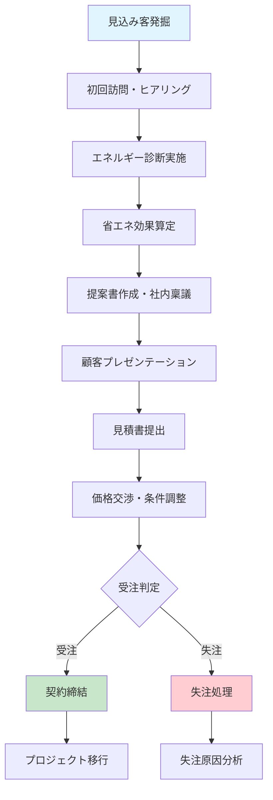
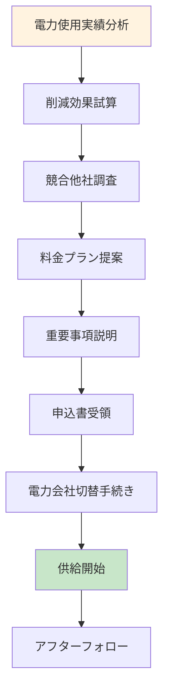

# エネルギーサービス業向け統合管理システム設計仕様書（完全版v24）
**社内実態調査結果反映版**

**文書番号**: SPEC-ENERGY-024  
**バージョン**: 24.0  
**作成日**: 2025年5月29日  
**ステータス**: 完全版・社内調査反映・RFP準備資料  
**対象**: システム構築ベンダー向け要件定義

---

## 1. プロジェクト背景と目的

### 1.1 社内実態調査結果分析

#### 1.1.1 現状システム利用状況

| システム/ツール | 利用部門 | 利用者数 | 利用状況 | 課題 |
|--------------|-------|--------|---------|------|
| **Salesforce** | 営業・技術・カスタマー | 30名 | 案件登録・議事録のみ | 活用率低・機能不足 |
| **Excel** | 全部門 | 100名 | 案件管理・工程管理・請求 | 属人化・非効率 |
| **勤次郎** | 全社 | 100名 | 勤怠管理 | 正常稼働 |
| **ESプロ** | カスタマー | 20名 | 設備台帳・記録 | 機能制限・帳票不備 |

#### 1.1.2 重要な発見事項

**イレギュラー請求の実態**:
```
【電力販売部門】
- 節電キャンペーン請求
- 特別割引適用請求  
- 発生頻度: 1%未満（年間1-2件程度）

【カスタマー部門】  
- 保守工事による別請求
- 契約延長時の定額変更請求
- エネルギーサービス金額変更対応
```

**文書管理の実態**:
- 基本: ローカルサーバ保存
- 担当者により分散（OneDrive・BOX混在）
- ファイル命名ルール無し
- アーカイブ運用無し

### 1.2 Salesforce導入失敗の根本的分析（調査結果反映）

#### 1.2.1 具体的失敗要因

| 失敗カテゴリ | 調査で判明した具体的問題 | 影響度 |
|------------|----------------------|-------|
| **機能不足** | ESプロ: 点検報告書機能なし、帳票出力不可 | 高 |
| **運用定着失敗** | エクセル併用継続、案件ステータス管理分離 | 高 |
| **承認プロセス** | 紙ベース継続、電子承認機能未活用 | 高 |
| **カスタマー業務** | 緊急対応記録の一覧表示不可 | 中 |
| **イレギュラー対応** | 電力請求・保守工事請求をExcelで対応 | 高 |

### 1.3 新システムの設計思想（調査結果基盤）

**基本方針**: 現場の実態に完全適合するシステム設計

1. **Excel併用前提設計**: 完全移行ではなく段階的統合
2. **紙ベース承認の段階的電子化**: 抵抗感を考慮した移行戦略
3. **イレギュラー請求完全対応**: 実際の業務パターンに基づく設計
4. **文書管理統一**: 分散した保存先の段階的統合
5. **現場負荷軽減**: 入力作業の最小化と自動化推進

---

## 2. 営業案件管理フロー設計

### 2.1 工事系営業フロー



#### 2.1.1 各フェーズの詳細業務

| フェーズ | 主要業務 | 使用ツール | 成果物 | 所要期間 |
|---------|---------|-----------|-------|---------|
| **見込み客発掘** | リスト作成・アポイント取得 | Power Apps | 見込み客リスト | 1週間 |
| **初回訪問** | 現状ヒアリング・関係構築 | Teams・SharePoint | 訪問記録 | 1日 |
| **エネルギー診断** | 現地調査・データ収集 | モバイルアプリ | 診断データ | 3-5日 |
| **効果算定** | 省エネ効果・投資回収計算 | Excel連携システム | 算定書 | 2-3日 |
| **提案書作成** | 提案書・稟議書作成 | Word連携・承認フロー | 提案書・稟議書 | 1週間 |
| **プレゼン** | 顧客説明・質疑応答 | Teams会議 | プレゼン資料 | 半日 |
| **見積提出** | 詳細見積・契約条件提示 | 見積システム | 見積書 | 2-3日 |
| **交渉・調整** | 価格・条件交渉 | メール・電話 | 交渉記録 | 1-2週間 |

### 2.2 電力販売営業フロー



#### 2.2.1 電力販売特有の業務

| フェーズ | 調査結果反映内容 | システム対応 |
|---------|---------------|------------|
| **実績分析** | 過去12ヶ月の電力使用データ分析 | API自動取得・分析機能 |
| **削減試算** | 基本料金・従量料金の詳細比較 | 料金シミュレーター |
| **重要事項説明** | 法的義務事項の完全対応 | 電子署名・記録管理 |
| **切替手続き** | 電力会社との複雑な手続き | ワークフロー自動化 |
| **イレギュラー対応** | **節電キャンペーン・割引処理** | **柔軟な請求調整機能** |

---

## 3. イレギュラー請求システム設計（調査結果完全反映）

### 3.1 実態調査に基づく請求パターン分類

#### 3.1.1 電力販売イレギュラー請求（発生率1%未満）

```javascript
// 電力販売イレギュラー請求パターン
const 電力販売イレギュラー = {
    節電キャンペーン: {
        概要: "夏期・冬期の節電協力に対する特別料金",
        処理方法: "基本料金からの割引適用",
        発生時期: "7-9月、12-2月",
        承認レベル: "部門長承認"
    },
    
    特別割引: {
        概要: "長期契約・大口契約に対する割引",
        処理方法: "従量単価の特別設定",
        適用条件: "契約年数・使用量基準",
        承認レベル: "役員承認"
    },
    
    契約変更調整: {
        概要: "契約プラン変更時の日割り計算",
        処理方法: "期間按分計算",
        発生頻度: "年1-2件",
        承認レベル: "部門長承認"
    }
};
```

#### 3.1.2 カスタマー部門イレギュラー請求

```javascript
// カスタマー部門イレギュラー請求パターン
const カスタマーイレギュラー = {
    保守工事別請求: {
        概要: "定期保守以外の修理・改修工事",
        処理方法: "別途見積→追加請求",
        発生頻度: "月2-3件",
        承認レベル: "部門長承認"
    },
    
    契約延長時定額変更: {
        概要: "エネルギーサービス契約延長時の金額改定",
        処理方法: "定額料金の変更設定",
        変更要因: "燃料費変動・設備更新",
        承認レベル: "役員承認"
    },
    
    緊急対応費用: {
        概要: "24時間緊急対応に伴う特別料金",
        処理方法: "時間外割増・出動費",
        計算基準: "基本料×1.5倍 + 出動費",
        承認レベル: "事後承認可"
    }
};
```

### 3.2 柔軟請求システム設計

#### 3.2.1 請求項目の動的追加機能

```javascript
// 動的請求項目管理システム
const 動的請求システム = {
    標準項目: {
        基本料金: { 固定値: true, 変更: false },
        従量料金: { 計算式: "使用量×単価", 変更: true },
        燃料費調整: { 自動更新: true, 変更: false }
    },
    
    // 調査結果を反映した追加項目
    イレギュラー項目: {
        節電キャンペーン割引: { 
            タイプ: "割引", 
            計算: "基本料金×割引率",
            承認: "部門長"
        },
        保守工事費: { 
            タイプ: "追加", 
            計算: "工事単価×作業時間",
            承認: "部門長"
        },
        緊急対応費: { 
            タイプ: "追加", 
            計算: "基本工賃×1.5 + 出動費",
            承認: "事後可"
        },
        契約延長調整: { 
            タイプ: "変更", 
            計算: "新定額×適用期間",
            承認: "役員"
        }
    },
    
    自由項目: {
        任意項目名: { 自由入力: true, 承認: "必須" },
        特別対応: { テキスト入力: true, 金額: "手入力" }
    }
};
```

#### 3.2.2 承認フロー（実態調査反映）

| 請求種別 | 金額範囲 | 承認ルート | 目標時間 | 調査結果反映 |
|---------|---------|----------|---------|------------|
| **標準請求** | 制限なし | 担当者→部門長 | 24時間 | 金額により変更（総務回答） |
| **節電キャンペーン** | 50万円未満 | 担当者→部門長 | 48時間 | 新規追加 |
| **保守工事** | 100万円未満 | 担当者→部門長→経理 | 48時間 | カスタマー要望反映 |
| **契約延長変更** | 制限なし | 担当者→部門長→役員 | 72時間 | カスタマー要望反映 |
| **緊急対応** | 50万円未満 | 事後承認可 | 事後24時間 | 新規追加 |

---

## 4. 部門別システム要件（調査結果詳細反映）

### 4.1 営業部門システム要件

#### 4.1.1 現状課題と対応策

| 調査で判明した課題 | 現状の対応 | 新システム対応 |
|-----------------|----------|-------------|
| **案件ステータス管理** | Excel併用 | Power Apps統合管理 |
| **Salesforce活用不足** | 議事録のみ入力 | 全営業プロセス統合 |
| **ファイル容量大** | 平均100MB、図面時1GB超 | 階層ストレージ対応 |

#### 4.1.2 営業支援機能設計

```javascript
// 営業支援システム機能
const 営業支援機能 = {
    案件管理: {
        登録方法: "Power Apps（Salesforce連携）",
        ステータス管理: "リアルタイム更新",
        ファイル管理: "自動分類・容量最適化",
        Excel統合: "既存Excelデータ取込み機能"
    },
    
    活動記録: {
        議事録: "Teams会議→自動テキスト化",
        訪問記録: "モバイル入力→自動同期",
        進捗管理: "ガントチャート表示",
        売上予測: "確度×金額の自動計算"
    }
};
```

### 4.2 技術部門システム要件

#### 4.2.1 現状課題と対応策

| 調査項目 | 現状 | 課題 | 新システム解決策 |
|---------|------|------|--------------|
| **工程管理** | Excel、Teams試験運用中 | 標準化不足 | 統合工程管理システム |
| **図書保存** | ローカルサーバ、フォルダバラバラ | 統一性なし | 標準フォルダ構成・自動分類 |
| **稼働管理** | Excel個人管理 | 可視化不足 | リアルタイム稼働状況表示 |
| **納期管理** | 担当者個人管理 | 全体把握困難 | 統合納期管理・アラート機能 |

#### 4.2.2 技術部門特化機能

```javascript
// 技術部門統合システム
const 技術部門システム = {
    工程管理: {
        現状: "Excel + Teams試験運用",
        改善: "統合ガントチャート + リアルタイム更新",
        連携: "営業システムとの自動連携"
    },
    
    図書管理: {
        現状: "ローカルサーバ・フォルダバラバラ",
        改善: "標準フォルダ構成・自動分類",
        機能: "CADファイル表示・版数管理"
    },
    
    稼働管理: {
        現状: "Excel個人管理",
        改善: "リアルタイム工数管理",
        可視化: "部門別・個人別稼働状況"
    }
};
```

### 4.3 カスタマー部門システム要件（重点強化）

#### 4.3.1 ESプロの課題と完全解決策

| ESプロの課題 | 調査結果 | 新システム解決策 |
|------------|---------|--------------|
| **点検報告書** | 機能なし・記録のみ | 完全な点検報告書自動生成 |
| **設備台帳** | 帳票出力不可 | 多様な帳票出力・Excel連携 |
| **緊急対応** | 一覧表示不可 | ダッシュボード・詳細分析 |
| **契約延長** | 機能なし | 完全な契約管理・承認フロー |

#### 4.3.2 カスタマー業務完全対応システム

```javascript
// カスタマー部門完全対応システム
const カスタマーシステム = {
    点検管理: {
        現状課題: "ESプロ機能不足",
        解決策: {
            報告書自動生成: "Word/Excelテンプレート活用",
            モバイル入力: "現場からの直接入力",
            写真管理: "自動位置情報付与・分類",
            履歴管理: "完全な点検履歴追跡"
        }
    },
    
    設備台帳: {
        現状課題: "帳票出力不可",
        解決策: {
            多様な帳票: "設備別・顧客別・期間別",
            Excel連携: "既存フォーマット活用",
            QRコード: "設備との紐付け管理",
            保守履歴: "設備別完全履歴"
        }
    },
    
    緊急対応: {
        現状課題: "記録あり・一覧なし",
        解決策: {
            24時間受付: "電話・メール・Teams統合",
            対応ダッシュボード: "リアルタイム状況表示",
            自動アサイン: "担当者・スキル別振り分け",
            顧客通知: "自動進捗通知システム"
        }
    },
    
    イレギュラー請求: {
        現状課題: "保守工事請求・契約延長対応なし",
        解決策: {
            保守工事請求: "作業内容→自動見積→請求生成",
            契約延長対応: "定額変更・期間調整・承認フロー",
            緊急対応課金: "時間外割増・出動費自動計算"
        }
    }
};
```

---

## 5. 文書・データ管理統合設計（調査結果反映）

### 5.1 現状の文書管理課題

#### 5.1.1 調査で判明した文書管理実態

| 課題項目 | 調査結果 | 問題点 | 解決方針 |
|---------|---------|-------|---------|
| **保存先分散** | ローカル+OneDrive+BOX | 検索困難・重複発生 | SharePoint統一移行 |
| **命名ルール** | ルール無し | ファイル識別困難 | 自動命名ルール適用 |
| **送受信記録** | 担当者により方法バラバラ | 履歴追跡不可 | 送受信フォルダ統一 |
| **アーカイブ** | 運用無し | 容量圧迫・性能低下 | 自動アーカイブシステム |

### 5.2 統合文書管理システム設計

#### 5.2.1 段階的移行戦略

```javascript
// 文書管理統合移行計画
const 文書管理移行 = {
    Phase1: {
        期間: "1-3ヶ月",
        対象: "新規プロジェクト",
        方針: "SharePoint標準運用開始",
        既存: "現状維持（参照のみ）"
    },
    
    Phase2: {
        期間: "4-6ヶ月", 
        対象: "進行中プロジェクト",
        方針: "重要ファイルの選択移行",
        既存: "ローカルサーバ併用"
    },
    
    Phase3: {
        期間: "7-12ヶ月",
        対象: "完了プロジェクト",
        方針: "必要最小限の移行",
        既存: "アーカイブサーバ移行"
    }
};
```

#### 5.2.2 ファイル命名規則（統一化）

```javascript
// 統一ファイル命名規則
const ファイル命名規則 = {
    基本形式: "[プロジェクト番号]_[文書種別]_[日付]_[版数]_[作成者].[拡張子]",
    
    例: {
        提案書: "2025-ME0123_提案書_20250601_v01_山田.pptx",
        図面: "2025-EL0124_単線結線図_20250601_v02_電気.dwg", 
        報告書: "2025-ME0123_点検報告書_20250601_final_カスタマー.pdf",
        請求書: "2025-ER0135_請求書_20250601_v01_経理.xlsx"
    },
    
    自動適用: {
        SharePoint: "アップロード時自動適用",
        Office365: "保存時自動提案",
        メール添付: "送信時自動チェック"
    }
};
```

---

## 6. システム統合・データ連携設計

### 6.1 既存システム統合方針

#### 6.1.1 Salesforce段階的移行

| 移行段階 | 期間 | Salesforce利用 | 新システム利用 | データ連携 |
|---------|------|-------------|-------------|----------|
| **Phase 1** | 1-6ヶ月 | 現状維持 | 請求システム先行 | 手動連携 |
| **Phase 2** | 7-12ヶ月 | 営業活動のみ | 工程・カスタマー移行 | API連携 |
| **Phase 3** | 13-18ヶ月 | 段階縮小 | 営業も移行開始 | 完全連携 |
| **Phase 4** | 19-24ヶ月 | 停止 | 完全移行完了 | 移行完了 |

#### 6.1.2 Excel業務の統合戦略

```javascript
// Excel業務統合アプローチ
const Excel統合戦略 = {
    継続利用: {
        対象: "個人計算・一時的分析",
        方針: "Excel Online統合",
        連携: "SharePoint自動同期"
    },
    
    段階移行: {
        案件管理: "Excel→Power Apps（3ヶ月）",
        工程管理: "Excel→Project Online（6ヶ月）",
        稼働管理: "Excel→Power BI（3ヶ月）"
    },
    
    完全置換: {
        請求処理: "Excel→Power Apps請求システム（即座）",
        承認管理: "紙→電子承認フロー（段階的）",
        報告書: "Excel→自動生成システム（6ヶ月）"
    }
};
```

### 6.2 データ統合アーキテクチャ

#### 6.2.1 統合データモデル

```sql
-- 顧客統合管理（調査結果反映）
CREATE TABLE 統合顧客マスタ (
    顧客ID VARCHAR(20) PRIMARY KEY,
    顧客名 NVARCHAR(100) NOT NULL,
    顧客分類 VARCHAR(20), -- 法人/個人/電力販売/工事
    業種 VARCHAR(50),
    所在地 NVARCHAR(200),
    与信枠 DECIMAL(15,0),
    与信ランク CHAR(1),
    電力契約フラグ BOOLEAN,
    工事契約フラグ BOOLEAN,
    保守契約フラグ BOOLEAN,
    登録日 DATETIME,
    更新日 DATETIME
);

-- プロジェクト統合管理
CREATE TABLE 統合プロジェクトマスタ (
    案件番号 VARCHAR(20),
    プロジェクト番号 VARCHAR(20) PRIMARY KEY,
    案件名 NVARCHAR(100),
    顧客ID VARCHAR(20),
    案件種別 VARCHAR(10), -- ES/ER/PP/RN/EP/ST/DX
    主工事種別 VARCHAR(10), -- ME/EL/AU/RN/ST/TK/CM
    プロジェクト金額 DECIMAL(15,0),
    開始予定日 DATE,
    完了予定日 DATE,
    ステータス VARCHAR(20),
    営業担当者 VARCHAR(50),
    技術担当者 VARCHAR(50),
    カスタマー担当者 VARCHAR(50)
);

-- イレギュラー請求管理（調査結果完全反映）
CREATE TABLE イレギュラー請求マスタ (
    イレギュラー請求ID VARCHAR(20) PRIMARY KEY,
    請求番号 VARCHAR(20),
    プロジェクト番号 VARCHAR(20),
    イレギュラー種別 VARCHAR(20), -- 節電キャンペーン/保守工事/契約延長/緊急対応
    発生部門 VARCHAR(20), -- 電力販売/カスタマー
    項目名 NVARCHAR(100),
    基準金額 DECIMAL(12,0),
    調整金額 DECIMAL(12,0),
    調整理由 TEXT,
    承認レベル VARCHAR(20),
    承認者 VARCHAR(50),
    承認日 DATE,
    適用開始日 DATE,
    適用終了日 DATE
);
```

#### 6.2.2 リアルタイムデータ連携

```javascript
// リアルタイムデータ同期システム
const データ連携システム = {
    営業データ: {
        ソース: "Power Apps営業システム",
        ターゲット: "Salesforce（移行期間中）",
        頻度: "リアルタイム",
        方式: "Power Automate + REST API"
    },
    
    工程データ: {
        ソース: "Teams + Project Online",
        ターゲット: "統合ダッシュボード",
        頻度: "1時間毎",
        方式: "Graph API"
    },
    
    請求データ: {
        ソース: "Power Apps請求システム",
        ターゲット: "会計システム",
        頻度: "日次",
        方式: "CSV出力 + FTP"
    },
    
    カスタマーデータ: {
        ソース: "モバイル点検アプリ",
        ターゲット: "統合設備台帳",
        頻度: "リアルタイム",
        方式: "Dataverse同期"
    }
};
```

---

## 7. 技術仕様・アーキテクチャ設計

### 7.1 システム基盤設計

#### 7.1.1 クラウド・ハイブリッド構成

```
【クラウド層（Microsoft 365）】
├── SharePoint Online（文書管理・2TB）
├── Dataverse（構造化データ・6GB追加）
├── Power Apps（業務アプリ・50ライセンス）
├── Power Automate（自動化・Premium）
├── Teams（コラボレーション・会議）
└── Power BI（分析・ダッシュボード）

【ハイブリッド層】
├── Azure Files（大容量ファイル・1TB）
├── オンプレミスデータゲートウェイ
└── VPN接続（セキュア通信）

【オンプレミス層】
├── ローカルサーバ（既存データ・アーカイブ）
├── Active Directory（認証統合）
└── 業務端末（Windows 10/11）
```

#### 7.1.2 容量設計（調査結果反映）

| データ種別 | 年間容量 | 累計（3年） | 保存先 | 備考 |
|----------|---------|-----------|-------|------|
| **一般プロジェクト** | 120GB | 360GB | SharePoint | 平均100MB×1,200件 |
| **図面含むプロジェクト** | 100GB | 300GB | Azure Files | 1GB×100件 |
| **電力販売データ** | 20GB | 60GB | SharePoint | 軽量データ中心 |
| **カスタマーデータ** | 60GB | 180GB | SharePoint | 点検写真・報告書 |
| **システムデータ** | 30GB | 90GB | Dataverse | 構造化データ |
| **合計** | **330GB/年** | **990GB** | - | 基本容量内 |

### 7.2 セキュリティ・認証設計

#### 7.2.1 統合認証システム

```javascript
// 統合認証・アクセス制御
const 認証システム = {
    基本認証: {
        方式: "Azure AD統合認証",
        MFA: "全ユーザー必須",
        デバイス認証: "登録デバイスのみ",
        場所制限: "オフィス+承認済みリモート"
    },
    
    アクセス制御: {
        部門別: {
            営業: "営業データ+共通データ",
            技術: "技術データ+共通データ",
            カスタマー: "カスタマーデータ+共通データ",
            管理: "全データ閲覧+承認権限"
        },
        
        機密レベル別: {
            機密: "管理者のみ（与信情報等）",
            社内限定: "部門限定（技術資料等）",
            一般: "全社員（共通資料等）"
        }
    },
    
    監査: {
        アクセスログ: "全操作記録",
        変更履歴: "Who/When/What/Why",
        異常検知: "通常パターンからの逸脱",
        レポート: "月次セキュリティレポート"
    }
};
```

#### 7.2.2 データ保護・暗号化

| データ分類 | 暗号化レベル | アクセス制御 | バックアップ | 保存期間 |
|----------|------------|------------|------------|---------|
| **与信情報** | AES-256 | 管理者のみ | 日次・遠隔地 | 永久 |
| **顧客情報** | AES-256 | 部門限定 | 日次 | 契約終了後5年 |
| **技術資料** | AES-128 | 技術部門 | 週次 | 10年 |
| **一般資料** | 標準暗号化 | 全社員 | 週次 | 3年 |

---

## 8. モバイル・現場対応システム

### 8.1 現場業務のデジタル化

#### 8.1.1 営業モバイルアプリ

```javascript
// 営業現場支援アプリ
const 営業モバイルアプリ = {
    機能: {
        顧客訪問: "GPS位置記録+時間記録",
        議事録: "音声→テキスト変換",
        写真撮影: "自動分類+位置情報付与",
        データ同期: "オフライン対応+自動同期"
    },
    
    連携: {
        SharePoint: "ファイル直接アップロード",
        Teams: "会議開始+画面共有",
        Power Apps: "案件情報リアルタイム更新",
        Outlook: "スケジュール連携"
    }
};
```

#### 8.1.2 技術・カスタマー現場アプリ

```javascript
// 現場作業支援アプリ
const 現場作業アプリ = {
    点検業務: {
        チェックリスト: "設備別カスタマイズ可能",
        写真撮影: "Before/After自動比較",
        データ入力: "音声入力+手書き認識",
        レポート生成: "現場で即座PDF生成"
    },
    
    緊急対応: {
        受付: "電話・メール・アプリ統合受付",
        位置情報: "最寄り担当者自動アサイン",
        進捗管理: "リアルタイム状況更新",
        顧客通知: "自動進捗通知"
    },
    
    工事管理: {
        工程確認: "ガントチャート+写真記録",
        品質管理: "検査項目+合否判定",
        安全管理: "安全チェック+ヒヤリハット",
        完了報告: "自動完了レポート生成"
    }
};
```

---

## 9. AI・自動化機能設計

### 9.1 業務自動化システム

#### 9.1.1 Power Automate自動化フロー

```javascript
// 主要自動化フロー
const 自動化フロー = {
    営業自動化: {
        案件登録: "メール→案件自動登録",
        フォルダ作成: "案件番号→自動フォルダ生成",
        進捗通知: "期限近づき→自動リマインダー",
        報告書作成: "活動データ→週次報告書自動生成"
    },
    
    技術自動化: {
        工程管理: "進捗入力→ガントチャート自動更新",
        品質管理: "検査結果→自動集計+グラフ化",
        完了処理: "完了報告→自動アーカイブ開始"
    },
    
    カスタマー自動化: {
        点検スケジュール: "設備台帳→点検計画自動生成",
        緊急対応: "受付→担当者自動アサイン→顧客通知",
        レポート生成: "点検データ→報告書自動作成"
    },
    
    請求自動化: {
        標準請求: "契約データ→請求書自動生成",
        イレギュラー請求: "追加項目→承認フロー→請求書生成",
        入金確認: "銀行データ→自動消込+未収管理"
    }
};
```

#### 9.1.2 AI機能活用

```javascript
// AI活用機能
const AI機能 = {
    文書分析: {
        OCR: "手書き文書→デジタル化",
        契約書分析: "契約条件自動抽出",
        図面認識: "CADファイル→設備情報抽出"
    },
    
    予測分析: {
        故障予測: "設備データ→故障時期予測",
        需要予測: "過去データ→電力需要予測",
        売上予測: "案件データ→売上予測"
    },
    
    自動応答: {
        チャットボット: "FAQ自動応答",
        緊急対応: "緊急度自動判定",
        スケジュール: "最適な訪問時間提案"
    }
};
```

---

## 10. 統合ダッシュボード・分析システム

### 10.1 Power BI統合ダッシュボード

#### 10.1.1 経営層向けダッシュボード

```javascript
// 経営ダッシュボード
const 経営ダッシュボード = {
    売上分析: {
        月次売上: "目標vs実績",
        事業別売上: "工事/電力販売/保守",
        顧客別売上: "上位顧客分析",
        地域別売上: "エリア別実績"
    },
    
    収益分析: {
        プロジェクト別利益: "利益率ランキング",
        部門別収益: "部門別貢献度",
        コスト分析: "原価構成分析",
        ROI分析: "投資効果測定"
    },
    
    業務効率: {
        案件処理時間: "受注までの期間",
        承認処理時間: "承認フロー効率",
        緊急対応時間: "初動対応速度",
        顧客満足度: "満足度推移"
    }
};
```

#### 10.1.2 部門別ダッシュボード

| 部門 | 主要指標 | 更新頻度 | 特徴 |
|------|---------|---------|------|
| **営業** | 受注率・売上予測・案件進捗 | 日次 | 個人目標達成状況 |
| **技術** | 工程進捗・品質指標・稼働率 | 日次 | プロジェクト横断状況 |
| **カスタマー** | 対応件数・満足度・保守実績 | 日次 | 緊急対応状況 |
| **管理** | 財務指標・承認状況・コンプライアンス | 週次 | 全社統合状況 |

### 10.2 データ分析・レポーティング

#### 10.2.1 自動レポート生成

```javascript
// 自動レポート生成システム
const 自動レポート = {
    日次レポート: {
        対象: "緊急対応・案件進捗・承認状況",
        配信先: "部門管理者",
        形式: "Teams通知+PDF"
    },
    
    週次レポート: {
        対象: "売上実績・工程進捗・品質指標",
        配信先: "経営層+部門長",
        形式: "Power BI+PDF"
    },
    
    月次レポート: {
        対象: "総合業績・顧客満足度・改善提案",
        配信先: "役員会",
        形式: "プレゼン資料+詳細資料"
    },
    
    イレギュラーレポート: {
        対象: "緊急対応・重大案件・承認遅延",
        配信先: "関係者",
        形式: "即座通知"
    }
};
```

---

## 11. 導入計画・チェンジマネジメント

### 11.1 段階的導入戦略（調査結果反映）

#### 11.1.1 フェーズ別導入計画

| フェーズ | 期間 | 主要作業 | 対象部門 | 成功指標 |
|---------|------|---------|---------|---------|
| **Phase 0** | 1ヶ月 | 現状分析・詳細設計 | 全部門 | 要件定義完了 |
| **Phase 1** | 2-4ヶ月 | 請求システム・基盤構築 | 経理・IT | 請求システム稼働 |
| **Phase 2** | 5-7ヶ月 | 営業・技術システム導入 | 営業・技術 | システム利用率50% |
| **Phase 3** | 8-10ヶ月 | カスタマーシステム導入 | カスタマー | ESプロ置換完了 |
| **Phase 4** | 11-12ヶ月 | 全社統合・最適化 | 全部門 | 利用率90%達成 |

#### 11.1.2 部門別導入アプローチ

```javascript
// 部門別導入戦略
const 部門別導入 = {
    営業部門: {
        アプローチ: "Excel併用→段階移行",
        重点: "Salesforce連携維持",
        期間: "6ヶ月",
        チャンピオン: "営業部長+主任2名"
    },
    
    技術部門: {
        アプローチ: "Teams運用拡張→統合",
        重点: "工程管理効率化",
        期間: "4ヶ月", 
        チャンピオン: "技術部長+リーダー3名"
    },
    
    カスタマー部門: {
        アプローチ: "ESプロ並行→完全移行",
        重点: "現場作業効率化",
        期間: "6ヶ月",
        チャンピオン: "カスタマー部長+現場責任者2名"
    },
    
    管理部門: {
        アプローチ: "承認フロー先行導入",
        重点: "電子化推進",
        期間: "3ヶ月",
        チャンピオン: "総務部長+経理部長"
    }
};
```

### 11.2 ユーザー教育・サポート体制

#### 11.2.1 教育プログラム

| 対象 | 内容 | 形式 | 期間 | 頻度 |
|------|------|------|------|------|
| **経営層** | システム概要・効果・ROI | プレゼン | 2時間 | 1回 |
| **部門長** | 管理機能・ダッシュボード | ハンズオン | 4時間 | 2回 |
| **一般ユーザー** | 基本操作・業務フロー | 集合研修 | 6時間 | 3回 |
| **チャンピオン** | 応用機能・トラブル対応 | 個別指導 | 12時間 | 4回 |
| **現場作業員** | モバイルアプリ・現場業務 | 実地研修 | 4時間 | 2回 |

#### 11.2.2 継続サポート体制

```javascript
// サポート体制
const サポート体制 = {
    レベル1: {
        担当: "社内チャンピオン",
        対応: "基本操作・FAQ",
        時間: "営業時間内",
        方法: "Teams・電話・訪問"
    },
    
    レベル2: {
        担当: "社内IT+ベンダー",
        対応: "システム障害・設定変更",
        時間: "24時間（緊急時）",
        方法: "リモート・オンサイト"
    },
    
    レベル3: {
        担当: "ベンダー専門チーム",
        対応: "重大障害・システム拡張",
        時間: "契約SLA内",
        方法: "専門技術者派遣"
    }
};
```

---

## 12. 投資効果・ROI分析

### 12.1 詳細コスト分析

#### 12.1.1 初期投資（福岡中堅SI想定）

| 項目 | 金額 | 備考 |
|------|------|------|
| **システム構築** | 2,200万円 | 基盤+各部門システム |
| **データ移行** | 300万円 | 既存データ整理・移行 |
| **カスタマイズ** | 400万円 | イレギュラー請求対応 |
| **教育・研修** | 200万円 | 全部門トレーニング |
| **インフラ** | 100万円 | ネットワーク・端末 |
| **初期投資計** | **3,200万円** | - |

#### 12.1.2 年間運用コスト

| 項目 | 年間コスト | 備考 |
|------|----------|------|
| **Power Apps Premium** | 162万円 | 50ライセンス |
| **Dataverse追加** | 39万円 | 6GB追加想定 |
| **Azure Files** | 30万円 | 1TB Premium |
| **保守・サポート** | 200万円 | ベンダーサポート |
| **システム管理** | 120万円 | 社内管理工数 |
| **年間運用計** | **551万円** | - |

### 12.2 効果分析

#### 12.2.1 定量効果（年間）

| 効果項目 | 年間効果額 | 算出根拠 |
|---------|----------|---------|
| **業務効率化** | 1,500万円 | 作業時間30%削減×人件費 |
| **イレギュラー請求効率化** | 300万円 | 請求処理時間50%削減 |
| **緊急対応効率化** | 400万円 | 初動時間40%短縮 |
| **文書管理効率化** | 200万円 | 検索時間70%削減 |
| **承認処理効率化** | 150万円 | 承認プロセス60%短縮 |
| **顧客満足度向上** | 300万円 | 継続率向上・新規獲得 |
| **年間効果計** | **2,850万円** | - |

#### 12.2.2 5年間ROI計算

**投資額**:
- 初期投資: 3,200万円
- 5年間運用: 2,755万円（551万円×5年）
- **総投資額: 5,955万円**

**効果額**:
- 5年間効果: 14,250万円（2,850万円×5年）
- **純効果: 8,295万円**

**ROI: 139%（投資回収期間: 2.1年）**

---

## 13. リスク管理・対策

### 13.1 主要リスクと対策

#### 13.1.1 技術リスク

| リスク | 発生確率 | 影響度 | 対策 |
|-------|---------|-------|------|
| **システム障害** | 中 | 高 | 冗長化・バックアップ体制 |
| **データ移行失敗** | 低 | 高 | 段階的移行・テスト徹底 |
| **性能不足** | 低 | 中 | 容量監視・拡張計画 |
| **セキュリティ侵害** | 低 | 高 | 多層防御・監視体制 |

#### 13.1.2 運用リスク

| リスク | 発生確率 | 影響度 | 対策 |
|-------|---------|-------|------|
| **ユーザー定着失敗** | 中 | 高 | 段階導入・教育徹底 |
| **Excel依存継続** | 中 | 中 | 統合機能・並行運用 |
| **紙承認継続** | 高 | 中 | 経営層コミット・インセンティブ |
| **現場抵抗** | 中 | 中 | 現場メリット訴求・チャンピオン制 |

### 13.2 継続的改善体制

```javascript
// 継続改善サイクル
const 継続改善 = {
    日次: {
        監視: "システム稼働状況",
        対応: "障害・問い合わせ",
        記録: "利用状況・エラー"
    },
    
    週次: {
        分析: "利用状況・課題抽出",
        改善: "小規模機能追加",
        教育: "個別サポート"
    },
    
    月次: {
        評価: "KPI達成状況",
        計画: "次月改善計画",
        報告: "経営層報告"
    },
    
    四半期: {
        見直し: "システム全体評価",
        拡張: "新機能追加検討",
        戦略: "中長期計画更新"
    }
};
```

---

## 14. ベンダー選定・契約

### 14.1 RFP評価基準（詳細版）

#### 14.1.1 技術評価（40点）

| 評価項目 | 配点 | 評価基準 | 必須要件 |
|---------|------|---------|---------|
| **Microsoft 365連携** | 12点 | 3年以上の開発実績・認定資格 | Gold Partner以上 |
| **イレギュラー請求対応** | 10点 | 柔軟な請求システム開発経験 | 実績3件以上 |
| **エネルギー業界理解** | 8点 | 電力・工事業界システム経験 | 類似業界実績 |
| **モバイル対応** | 6点 | 現場業務アプリ開発実績 | iOS/Android対応 |
| **API連携技術** | 4点 | 外部システム連携実績 | REST/SOAP対応 |

#### 14.1.2 体制評価（30点）

| 評価項目 | 配点 | 評価基準 | 必須要件 |
|---------|------|---------|---------|
| **PM能力** | 10点 | PMP・情報処理技術者資格 | 大規模PJ経験3年以上 |
| **技術者スキル** | 8点 | Microsoft認定資格保有率 | チーム50%以上保有 |
| **地域対応** | 7点 | 福岡県内拠点・常駐可能 | 2時間以内駆けつけ |
| **サポート体制** | 5点 | 24時間サポート体制 | 緊急時対応SLA |

#### 14.1.3 提案評価（20点）

| 評価項目 | 配点 | 評価基準 |
|---------|------|---------|
| **導入方法論** | 8点 | 段階導入・リスク管理 |
| **チェンジマネジメント** | 6点 | ユーザー定着戦略 |
| **将来拡張性** | 6点 | AI・IoT対応計画 |

#### 14.1.4 コスト評価（10点）

| 評価項目 | 配点 | 評価基準 |
|---------|------|---------|
| **初期コスト** | 5点 | 予算内・コスパ |
| **運用コスト** | 3点 | 5年TCO合理性 |
| **追加費用** | 2点 | 変更対応柔軟性 |

### 14.2 契約条件

#### 14.2.1 基本契